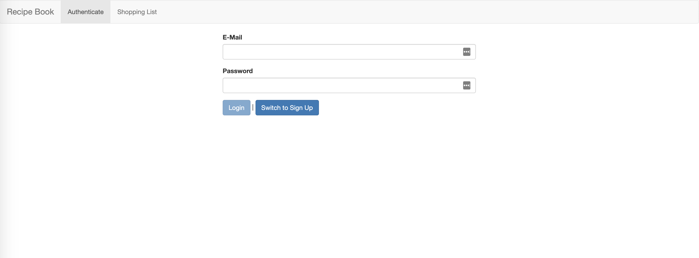
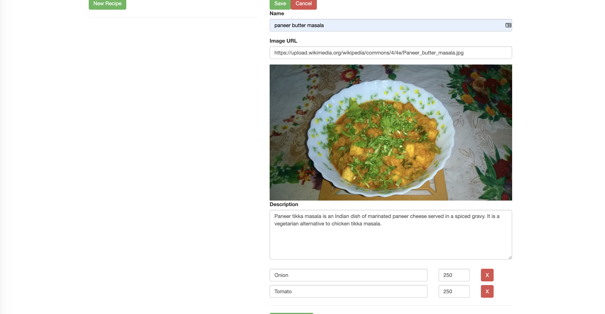
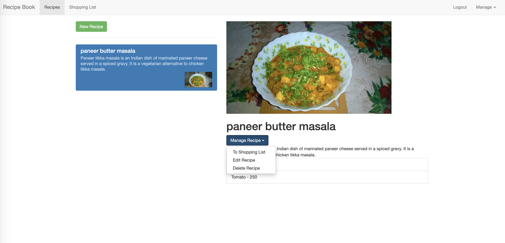
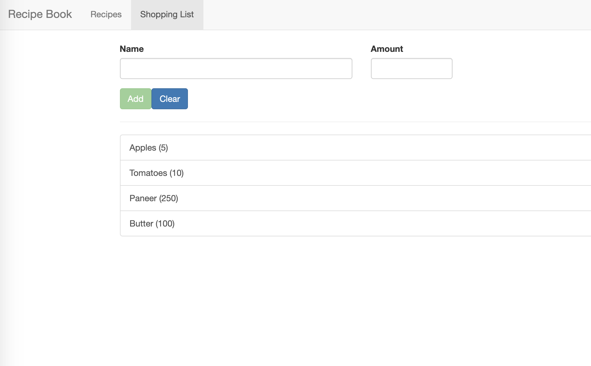

# Recipe Book

> Application to create and manage recipes

## Table of contents

* [General info](#general-info)
* [Screenshots](#screenshots)
* [Technologies](#technologies)
* [Setup](#setup)
* [Features](#features)
* [Status](#status)

## General info

This application allows user to create/manage recipes and add ingredients to shopping list

## Screenshots

1.Login page

2.Recipe list page

3.Edit Recipe page

4.Shopping List page

## Technologies

* Angular 8.0
* Ngrx - State management
* Firebase - Authentication
* Typescript

## Setup

* Clone the project
* From terminal, run `npm install` to build all dependencies in project
* Add your firebase Api key in environment.ts and environment.prod.ts
    export const environment = {
      production: false,
      firebaseAPIKey: 'YOUR KEY'
    };
* Run `ng serve` for a dev server. Navigate to `http://localhost:4200/`. The app will automatically reload if you change any of the source files

## Features

List of features available to users,

* Sign Up/Sign In functionality
* User can add/edit/delete recipes
* User can add ingredients from recipe to shopping list
* Logout functionality

To-do list:

* Database(Firestore) is yet to be integrated with the project
* Optimize pages for mobile view

## Status

Project is: _in progress_